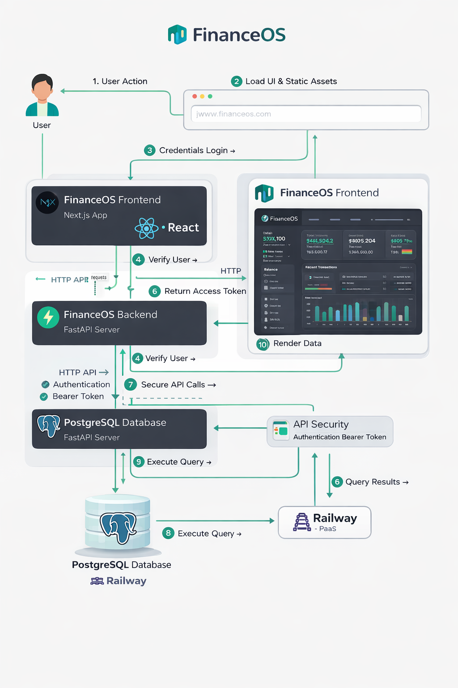

# 💸 FinanceOS – Full Stack Finance Dashboard

A modern full-stack financial management system built with **FastAPI + Next.js** that allows users to track income, expenses, and analyze financial data with role-based access.

---

## 🌐 Live Demo

- 🔗 Frontend: https://zorvyn-finance-assignment-ochre.vercel.app/users
- 🔗 Backend API: https://zorvyn-finance-assignment-production.up.railway.app/docs

---

## 📌 Features

### 🔐 Authentication & Authorization
- JWT-based authentication
- Role-based access control:
  - 👑 Admin
  - 📊 Analyst
  - 👀 Viewer

---

### 💰 Financial Management
- Add / Update / Delete transactions
- Categorize income & expenses
- Filter by:
  - Date
  - Category
  - Type (income/expense)

---

### 📊 Dashboard Analytics
- Total Income
- Total Expenses
- Net Balance
- Savings Rate
- Monthly Trends
- Category-wise insights
- Recent activity tracking

---

### 👥 User Management
- Create users with roles
- Activate / Deactivate users
- View user stats (Admins / Analysts / Viewers)

---

## 🏗️ Tech Stack

### 🔹 Backend
- FastAPI
- PostgreSQL
- SQLAlchemy
- Pydantic
- JWT Authentication

### 🔹 Frontend
- React 18 
- Tailwind CSS
- Recharts (Chart Libraries) (for analytics)

### 🔹 Deployment
- Backend → Railway
- Frontend → Vercel
- Database → Railway Postgres

---

## ⚙️ System Design Flow


## 🎯 Why I Built This

I wanted to build a production-ready financial system that demonstrates:

- Real-world authentication (JWT)
- Role-based access control (RBAC)
- Data aggregation & analytics
- Full deployment pipeline (Railway + Vercel)

This project reflects how modern SaaS dashboards are designed and deployed.
## 🔐 API Overview
 
All endpoints are prefixed with `/api/v1`.
 
### Authentication
| Method | Endpoint | Auth | Description |
|---|---|---|---|
| POST | `/auth/register` | None | Register new user (default: viewer) |
| POST | `/auth/login` | None | Login and receive JWT token |
| GET | `/auth/me` | Any | Get current user profile |
 
### Transactions
| Method | Endpoint | Min Role | Description |
|---|---|---|---|
| GET | `/transactions` | Viewer | List with filters, search, pagination |
| GET | `/transactions/{id}` | Viewer | Get single transaction |
| POST | `/transactions` | Admin | Create new record |
| PATCH | `/transactions/{id}` | Admin | Update record |
| DELETE | `/transactions/{id}` | Admin | Soft-delete record |
 
### Dashboard
| Method | Endpoint | Min Role | Description |
|---|---|---|---|
| GET | `/dashboard/summary` | Viewer | Full aggregated analytics |
 
### Users (Admin only)
| Method | Endpoint | Description |
|---|---|---|
| GET | `/users` | List all users |
| PATCH | `/users/{id}` | Update role or status |
| DELETE | `/users/{id}` | Deactivate user |
 
---
 

## 🐛 Problems I Faced and How I Solved Them
 
This section is honest about the real friction I ran into during development.
 
### 1. CORS Blocking the Frontend — The Hardest Bug to Diagnose
 
The most frustrating issue was when I deployed the frontend and every API call failed with `Failed to fetch`. The backend logs showed the requests were arriving fine but the browser was silently dropping the responses.
 
The root cause was that my React dev server was running on **port 3001** instead of the expected 3000 (because something else was occupying 3000). The CORS middleware was configured to allow only `localhost:3000`, so every request from `localhost:3001` was rejected at the browser level before the response could be read.
 
My first instinct was to check the backend code for bugs. I spent time looking at the route handlers, the auth middleware, the database connection — none of it was wrong. It took opening the browser DevTools Network tab and reading the actual CORS error to understand what was happening.
 
The fix was twofold: add all relevant origins to the CORS allowlist during development, and later switch to `allow_origins=["*"]` with `allow_credentials=False` for the local environment. For production on Railway, I set the specific Vercel domain explicitly.
 
**What I learned:** CORS errors are browser-level blocks, not server errors. The server returns 200 but the browser refuses to hand the response to JavaScript. Always check the Network tab — not just the console — when debugging fetch failures.
 
### 2. JWT Token Expiry Mid-Session
 
The default token expiry was set to 30 minutes. During testing I would set up users, add transactions, and come back to the dashboard after a break — only to find every API call returning `401 Could not validate credentials`. The error surfaced in the Edit User modal which made it look like a permissions bug rather than an expiry issue.
 
The fix had two parts: extend `ACCESS_TOKEN_EXPIRE_MINUTES` to 1440 (24 hours) in the `.env` file for development, and add an automatic redirect to `/login` in `api.js` whenever a 401 response is received. This way the user gets cleanly sent to the login page instead of seeing a confusing error in the middle of a modal.
 
```js
if (res.status === 401) {
  localStorage.removeItem("token");
  window.location.href = "/login";
  return;
}
```
 
**What I learned:** Token expiry is invisible until it happens at the worst moment. Auto-logout on 401 is not optional — it is the minimum expected behaviour for any authenticated app.
 
### 3. Accidentally Creating an Analyst as Viewer with Inactive Status
 
During user setup I registered `analyst1` but forgot to specify the correct role, so they were created as a Viewer. I then tried to fix it from the frontend Edit User modal — which triggered the CORS bug above — so both the role and the status ended up wrong.
 
Rather than fighting the frontend while CORS was broken, I went directly to the Swagger UI at `/docs`, authenticated with the admin token, and sent the PATCH request manually:
 
```json
{
  "role": "analyst",
  "status": "active"
}
```
 
This fixed both problems in a single request. It also confirmed that the backend logic itself was correct — the bug was entirely in how the frontend was communicating with it.
 
**What I learned:** Having interactive API docs (`/docs`) is not a nice-to-have for development — it is a debugging tool. Being able to test endpoints directly, bypassing the frontend entirely, saved a lot of time.
 
### 4. PostgreSQL Connection on Railway
 
Connecting the deployed backend to the Railway PostgreSQL instance required understanding how Railway injects environment variables. The `DATABASE_URL` format Railway provides uses `postgres://` as the scheme, but SQLAlchemy 2.0 requires `postgresql://`.
 
The fix was a one-line normalisation in `config.py`:
 
```python
DATABASE_URL: str = Field(..., env="DATABASE_URL")
 
@validator("DATABASE_URL", pre=True)
def fix_postgres_scheme(cls, v):
    if v.startswith("postgres://"):
        return v.replace("postgres://", "postgresql://", 1)
    return v
```
 
**What I learned:** Cloud providers and libraries do not always agree on URL formats. Always read the SQLAlchemy docs when something that works locally fails in production for no obvious reason.

## 🚀 Local Setup
 
### Prerequisites
- Python 3.11+
- PostgreSQL 14+
- Node.js 18+
 
### Backend
 
```bash
cd finance-backend
python -m venv venv
source venv/bin/activate        # Windows: venv\Scripts\activate
pip install -r requirements.txt
cp .env.example .env            # Edit DATABASE_URL and SECRET_KEY
alembic upgrade head
uvicorn app.main:app --reload
```
 
### Frontend
 
```bash
cd finance-frontend
npm install
npm start
```
 
Open `http://localhost:3000` — default admin credentials: `admin / Admin@123`
 
---


 ## 👤 Author
 
**Akash Parley**
GitHub: [@AkashParley](https://github.com/AkashParley)

